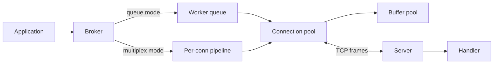
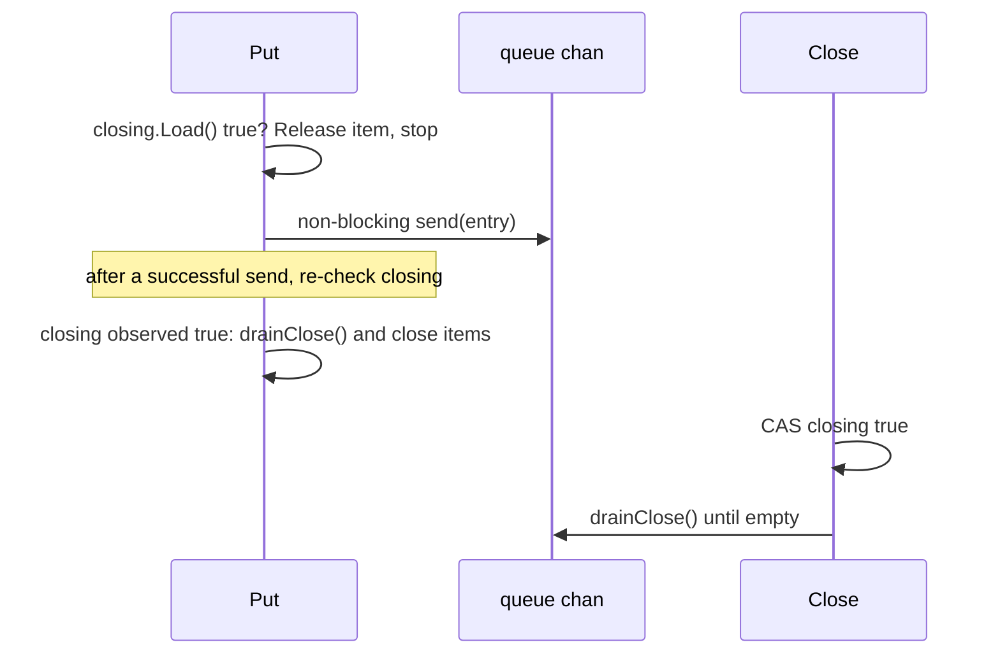
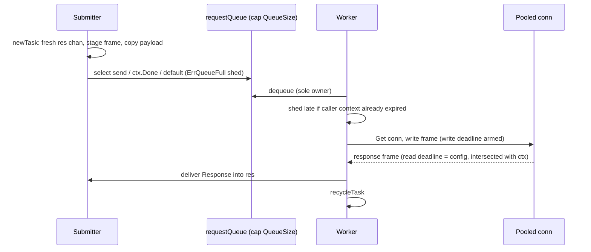
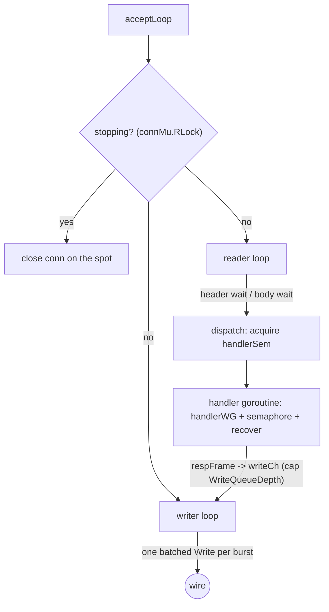

# anet Architecture

anet is an asynchronous, framed request/response networking library for TCP.
It combines connection pooling with health management, a task-ID-correlated
broker that offers two interchangeable transports (queue workers or
per-connection pipelining), and an embeddable TCP server.
Module path: `github.com/andrei-cloud/anet`.

This document describes the asynchronous build introduced on the
`perf/async-networking` branch. Usage examples live in the
[README](../README.md); the record of what changed lives in the
[CHANGELOG](../CHANGELOG.md).

Contents: §1 goals · §2 protocol · §3 components · §4 buffer pool ·
§5 framing · §6 connection pool · §7 task ownership · §8 broker · §9 server ·
§10 invariants · §11 deadlines · §12 shutdown and shedding · §13 allocation
ledger · §14 failure model · §15 tests.

---

## 1. Design goals

| Goal | Consequence in the design |
| :-- | :-- |
| Bounded shutdown | `broker.Close` waits at most `CloseTimeout`. `server.Stop` waits at most `ShutdownTimeout`, then force-closes. Pool waits wake on caller context, broker close, or pool close. No library goroutine can hang forever. |
| Exactly-once finalization | Every accepted request receives exactly one `Response`. Every connection a pool accepted is closed exactly once. Every worker is counted before its goroutine launches. |
| Caller-memory isolation | Once `submit` returns, no broker goroutine ever reads the caller's request bytes again. |
| Allocation-minded hot path | Framing and buffers avoid heap work where possible. The per-request allocations that remain are deliberate and priced in §13. |
| Dead config fields die | Every config field now has observable behavior. This build wired five fields that were previously declared but inert, and each cost is measured. |

---

## 2. Wire protocol

```
+-------------------+--------------------+------------------------+
| Length (2 bytes)  | Task ID (4 bytes)  | Payload (N bytes)      |
| BigEndian uint16  | BigEndian uint32   | Application message    |
+-------------------+--------------------+------------------------+
```

* `LENGTHSIZE = 2` (exported). The length header counts **Task ID plus
  payload**: `length = taskIDSize + payloadLen`, where `taskIDSize = 4`.
* The largest legal payload is `65535 - 4 = 65531` bytes. Anything larger is
  rejected with `ErrMaxLenExceeded` while the frame is staged. The removed
  scatter-gather write path instead truncated `uint16(payloadLen)` at
  65532 bytes, emitting a header that counted 0 payload bytes and
  desynchronizing the stream.
* Task IDs come from a per-broker `atomic.Uint32` (`broker.nextID`). They used
  to come from a package-global counter, which made every broker in a process
  ping-pong a single cache line.
* Responses may arrive in any order; correlation is by task ID. Queue mode
  historically required in-order responses; multiplex mode never does.
* Server handlers see the request without the task ID. The server strips the
  4-byte ID before calling `HandleMessage` and re-attaches it to the response.

`anet.Write`, `anet.Read`, and `anet.ReadPooled` implement plain
`[length][payload]` framing. The broker layers the task-ID convention on top
of that byte stream.

---

## 3. Component map

| File | Component | Responsibility |
| :-- | :-- | :-- |
| `bufferpool.go` | Buffer pool | Power-of-two `[]byte` recycling, 32 B to 64 KB. |
| `utils.go` | Framing | `Write`, `Read`, `ReadPooled`, `RingBuffer`, length sentinels. |
| `pool.go` | Connection pool | Reusable connections, idle eviction, validation, `NewTCPFactory` dialing. |
| `task.go` | Task | One request in flight: identity, staged frame, delivery channel. |
| `broker.go` | Broker | Submit/deliver orchestration, queue transport, lifecycle accounting. |
| `pipeline.go` | Multiplex transport | Per-connection writer and reader goroutines, ID correlation. |
| `server/` | Server | Embeddable TCP server speaking the same framing. |



---

## 4. Buffer pool (`bufferpool.go`)

Twelve `sync.Pool` instances, one per power-of-two size class from
`1<<5 = 32` bytes to `1<<16 = 64 KB` (`minClassShift` = 5, `maxClassShift`
= 16).

* **Class selection is total.** `GetBuffer(size)` picks the class with
  `bits.Len32(size-1) - minClassShift` (for `size > 32`), so a 33-byte request
  is served from the 64-byte class: `len == 33`, `cap >= 64`. `PutBuffer`
  derives the class from capacity: `bits.Len32(cap) - 1 - minClassShift`
  maps every `cap` in `[32, 65536]` to the class of `2^floor(log2(cap))`,
  which is never larger than `cap`. Every buffer taken from a pool can
  therefore be returned to a pool that will hand it out again. Two boundary
  clamps in the old code were unreachable by this arithmetic; they are
  replaced by comments deriving the ranges.
* **Pointer recycling.** `sync.Pool.Put(any)` with a raw `[]byte` heap-boxes
  the slice header (a 24-byte `convTslice` conversion). The pool therefore
  stores `*[]byte` pointers recycled from a dedicated `ptrPool`, which makes
  `PutBuffer` allocation-free. Measured round-trip: about 12 ns/op,
  0 B/op, 0 allocs/op.
* Buffers whose capacity exceeds 64 KB are deliberately not pooled: oversized
  objects parked in a `sync.Pool` are memory bloat that never comes back.

---

## 5. Framing helpers (`utils.go`)

`Write` stages header and payload into a buffer-pool buffer and performs one
`w.Write`. The previous build had a "fast path" for messages up to 512 bytes
that formatted into a `[512]byte` stack array; escape analysis shows the array
escapes through the `io.Writer` interface call, and it measured 576 B/op of
heap allocation despite the comment claiming otherwise. Buffer-pool staging
replaced it: 0 B/op, 0 allocs/op, and 36% faster. (The same escape trap
explains why staging through `bufio.Writer` would not have helped either:
`bufio.Writer.Write` passes its argument on to an inner interface sink.)

`Read` returns a freshly heap-allocated payload; the caller owns it (the GC
frees it; it must never be passed to `PutBuffer`). `ReadPooled` instead
allocates from the buffer pool and transfers a `PutBuffer` obligation to the
caller; the server uses it under strict single-owner discipline (§9.3).

`RingBuffer[T]` is a power-of-two ring buffer for single-goroutine use. Its
`nextPow2Uint64` helper clamps at `2^63`: the bit-saturation trick overflows
to zero for input `2^64 - 1`, which would silently build a zero-capacity ring
that rejects every enqueue.

---

## 6. Connection pool (`pool.go`)

```go
type pool struct {
    queue     chan *poolEntry // idle connections; capacity == pool capacity
    count     atomic.Uint32   // live connections created
    closing   atomic.Bool
    entryPool sync.Pool       // poolEntry wrapper recycling
    ...
}

type poolEntry struct {
    item   PoolItem
    idleNs atomic.Int64 // unix nanos of the Put that parked the item
}
```

### 6.1 Lock-free hot path and the Close handshake

There is no mutex around `Get` and `Put`. The previous build held an
`RWMutex` around every queue operation solely to arbitrate the `Close` drain,
and its reader-count RMW operations measured around 100 ns/op of contention
overhead on top of an operation that is otherwise pure channel traffic.

The replacement is a handshake ordered by the `closing` flag:



Every interleaving is covered by the total order on the flag: a send that
lands before the CAS is seen by Close's drain; a send that lands after the CAS
is observed by the sender's own post-send check, and the sender then drains the
queue and closes the items itself. A channel handoff has exactly one receiver,
so each item is closed exactly once no matter who drains it. This handshake is
validated under an eight-worker hammer (`TestPoolConcurrentPutClose`).

`Release` decrements `count` through a CAS loop with a zero floor. The old
unconditional decrement let a single double-`Release` wrap the `uint32` to
about 4.29e9, after which the capacity check is permanently true and the pool
can never dial again — a silent zombie pool.

### 6.2 Idle eviction (IdleTimeout, now enforced)

`PoolConfig.IdleTimeout` used to be a dead field: connections could sit in the
pool past it forever. The wiring:

* `Put` stamps `idleNs` with one clock read — the only hot-path cost the
  feature adds (about 25 ns per Put; a design that also checked expiry on
  every `Get` measured 76 ns/op against a 17.5 ns/op floor with no eviction
  at all, a 4x microbenchmark regression that was removed).
* A background sweeper runs once per `ValidationInterval`: it drains the
  idle queue, evicts expired items **by stamp alone** (no I/O is spent on
  connections already judged dead), protocol-validates at most five survivors,
  and re-parks the rest with their original stamps. Re-validating a connection
  does not make it less idle, so stamps are never refreshed by validation.
* `Get` does not consult the clock. A connection that expired between sweeps
  fails its next write; the broker `Release`s it and the following `Get` dials
  a replacement. This is the same trade net/http idle-connection closes make,
  and it keeps the hot path clock-free.

### 6.3 Validation and the self-validation hook

`validateConnection` first asks the item to validate itself:

```go
if v, ok := item.(interface{ Validate() bool }); ok {
    return v.Validate()
}
```

Multiplexed pipelines implement it (liveness simply means "not dead"), because
a raw `ValidationRead` probe would compete with the pipeline's reader
goroutine for bytes on the wire. Without a self-validator the configured
strategy applies: `ValidationRead` treats a read timeout as healthy but
treats *arriving data* as poisoning (the peer sent unsolicited bytes);
`ValidationPing` is the same probe with a fixed 10 ms window;
`ValidationNone` accepts everything. The inter-attempt `time.Sleep(10ms)` was
removed: every attempt is already bounded by `ValidationTimeout`, and the
sleep only delayed declaring a connection dead.

### 6.4 `NewTCPFactory`

`anet.NewTCPFactory(cfg)` returns a `Factory` that finally applies the
`PoolConfig` dial fields: `net.DialTimeout` (covers DNS plus connect),
`SetKeepAlive` with `SetKeepAlivePeriod(cfg.KeepAliveInterval)` (negative
disables), and `SetNoDelay(true)` unless `DisableNoDelay` is set — framed
request/response traffic is latency-sensitive, and Nagle only adds delay.

Multiplex mode especially recommends it: multiplex reads are deliberately
undeadlined while a connection is idle (§8.2), so TCP keepalive is what
surfaces a silent peer.

---

## 7. Task ownership ("scheme Z")

This is the most important correctness structure in the library, because it
is what the historical bug class violated.

**The historical bug.** A caller whose context expired while its task sat
inside the request queue used to return the task to its `sync.Pool` while the
task's pointer was still queued. Minutes of reasoning cannot predict what
happens next, but the code does: a worker later dequeued the zombie and wrote
a frame built from stale fields (this was the true source of the spurious
`task ID mismatch` errors on perfectly healthy connections), and once a fresh
`Send` grabbed the recycled task from the pool, two workers ran the *same
task struct* concurrently, with concurrent writes into its frame buffer and
cross-delivered responses.

**The root cause.** A buffered channel that holds a pointer is an implicit
*third owner* of that pointer. The old reference count accounted for exactly
two holders — caller and worker — and a task cancelled while queued dropped
to zero references while the queue still pointed at it.

**The fix.** Reference counting was removed entirely and replaced with a
handoff invariant:

```mermaid
flowchart LR
    S[Submitter goroutine] -->|1. newTask: alloc res chan, stage frame| S
    S -->|2. enqueue (owns until send fails)| Q[request queue]
    Q -->|3. dequeue: sole owner| W[Worker or Close drain]
    W -->|4. write frame, read response| W
    W -->|5. deliver exactly one Response| R[res chan, cap 1 - caller-owned]
    W -->|6. recycleTask in defer| P[taskPool]
```

1. **The submitter owns the task exclusively until it is enqueued.**
   `newTask` allocates the fresh `res chan Response` (cap 1) and stages the
   complete frame `[len][id][payload]` — including one copy of the caller's
   payload — inside the caller's own goroutine, where reading `*request` is
   trivially safe. After `submit` returns, the caller holds only the result
   channel, never the task. A timed-out caller can therefore only ever
   recycle a task it never enqueued (the shed path), never a queued one.
2. **Exactly one queue consumer** — a worker, or `Close`'s drain loop —
   inherits ownership of each task and recycles it exactly once in a `defer`
   on every exit path.
3. **Delivery never blocks.** The result channel is buffered with room for
   exactly the one delivery that is guaranteed per task lifetime; the
   `default` branch only covers a caller that abandoned the channel, whose
   GC then reclaims it.

### 7.1 Why the delivery channel is allocated per request

The tempting optimization — pooling the `res` channel together with the Task
and draining stale entries at recycle or reuse time — was actually tried
first in this rewrite, and it **deadlocked the benchmark suite twice** before
being understood. The interleaving: a worker delivers a response into the
slot, recycles the task into the `sync.Pool`, and the *next* submitter's
stale-entry drain removes the response from the slot *before the parked
waiter's `select` is ever scheduled*. The response vanishes; the waiter parks
forever.

The old design was safe only because its refcount gated recycling until "the
caller has already finished consuming". Scheme Z deliberately decouples
task recycling from response consumption (that decoupling is what makes the
async API possible), and for that pattern a pooled single-slot channel cannot
work. One fresh channel per request (about 96 bytes) buys exact-once delivery;
§13 prices it in the ledger.

### 7.2 Task recycling

`recycleTask` keeps the task's grown frame buffer when it is at most
`maxFrameRetain` (64 KB): the buffer is adopted permanently by the pooled
task, so steady-state frames cost no allocation. Frames borrowed from the
buffer pool above that size are flagged `transient` and returned on recycle.
Recycling must **not** drain the result channel (see 7.1). All caller fields
are cleared before `taskPool.Put` so idle tasks retain no user bytes.

---

## 8. Broker (`broker.go`)

```go
type Broker interface {
    Send(req *[]byte) ([]byte, error)
    SendContext(ctx context.Context, req *[]byte) ([]byte, error)
    SendAsync(req *[]byte) (<-chan Response, error)
    SendAsyncContext(ctx context.Context, req *[]byte) (<-chan Response, error)
    Start() error
    Close()
}
```

All four send methods converge on one internal pipeline: `submit(ctx, req)`
stages and hands off the task, `wait(res, ctx)` receives. `Send` is exactly
`SendAsync` plus `wait` with a nil caller context. The exported
`Response{Payload []byte; Err error}` channel is the asynchronous API surface:
exactly one `Response` arrives per accepted submission, and a caller that
never receives from the channel leaks nothing beyond GC-able memory once the
request settles. Payload ownership: caller-owned heap bytes; never pass them
to `PutBuffer`.

`Response.Payload` differs in one ownership detail from `ReadPooled`: the
async/sync payloads are plain heap bytes for the GC, while `ReadPooled`
buffers carry a `PutBuffer` duty. The distinction is documented at both
methods.

### 8.1 Queue mode (default)



The queue is bounded by `QueueSize`; a full queue sheds with `ErrQueueFull`
(load shedding) rather than parking callers. Workers take one connection per
task, run one synchronous request/response exchange, and then:

* `Put` the connection back on success; or
* `Release` it (close it) after **any** connection-level error. The rule:
  a connection whose stream state is unknown is quarantined, because
  returning it to the pool would hand the *next* task the *previous* task's
  half-read response. The task-ID equality check catches such corruption,
  but the connection is already dead weight by then.

Three wake-up rules, each the fix of a shipped hang:

1. A task without a caller context parks in the pool using the **broker
   context**, so `broker.Close` wakes workers parked on an exhausted pool.
   (Workers used to park there blind to the broker, hanging `Close` forever.)
2. I/O deadlines always exist: a zero config timeout means the 5s default,
   and a negative value explicitly disables the deadline. (A zero
   `ReadTimeout` used to mean "block forever".)
3. The read deadline is intersected with the caller context's deadline when
   the caller's is tighter, so cancellation bounds the wire wait too.

### 8.2 Multiplex mode (`pipeline.go`)

Setting `BrokerConfig.Multiplex = true` replaces the worker queue with one
`pipeline` per connection, created lazily when the broker first gets an item
from a pool:

```go
type pipeline struct {
    wch     chan *Task        // frames awaiting write (cap = MaxInflightPerConn)
    pmu     sync.Mutex        // guards: pending, writing
    pending map[uint32]*Task  // outstanding requests, keyed by task ID
    writing *Task             // task whose frame is inside conn.Write
    dead    atomic.Bool       // stream state lost
    quit    chan struct{}     // closed once by fail(): exits both goroutines
    wg      sync.WaitGroup    // tracks writer and reader goroutines (tests)
}
```

```mermaid
sequenceDiagram
    participant A as Submitter
    participant P as pipeline.submit
    participant W as Writer goroutine
    participant N as net.Conn
    participant R as Reader goroutine
    A->>P: submit(task)
    P->>P: lock: reject if dead / pending at bound / duplicate ID
    P->>P: pending[task.id] = task; enqueue frame
    P->>A: return ok; pipeline goes straight back to the pool
    W->>N: Write(task.frame) with write deadline
    N-->>R: response frame arrives (any order)
    R->>R: parse header; payload = make(len); task = pending[id]; delete
    R->>A: task.res <- Response{Payload}; recycleTask(task)
```

Design points:

* **Checked back in at submit.** A connection is returned to the pool
  immediately after `submit` registers the request, so it keeps serving while
  its response is outstanding. Throughput scales as
  `connections x MaxInflightPerConn` outstanding requests with **zero worker
  goroutines**; `Start` is not needed.
* **Correlation.** The reader looks `pending[id]` up. An unknown ID is a late
  response for a request that was already failed or shed: it is logged
  ("multiplex: dropping response for unknown task ID") and dropped.
* **Shedding.** The pending map at `MaxInflightPerConn` sheds `ErrQueueFull`.
  The writer additionally sheds tasks whose caller context already expired,
  *before* spending a write — nobody could receive the response anyway.
* **Failing exactly once.** `fail(cause)` swaps the pending map out under the
  mutex and delivers an error Response for each task, once. The one exception
  is the `writing` task: the task whose `conn.Write` is in progress is skipped
  by `failAll` and resolved by the writer itself after `Write` returns —
  recycling it during the write would restage the task under the writer's
  bytes, and silently succeeding the write on a dead stream leaves no one
  else to deliver its response.
* **Idle reads are undeadlined.** The reader arms a `ReadTimeout` deadline
  only while requests are outstanding and clears it when the map is empty.
  Quiet connections stay open; TCP keepalive (via `NewTCPFactory` dials) is
  what surfaces silent peers.
* **Pool interaction.** The pipeline implements `Validate() bool`
  ("not dead"), so the pool's raw validation probes never race the reader
  goroutine (§6.3). `Close` on a pipeline fails every pending task once,
  closes the connection, and both goroutines exit via `quit`.

`submitMuxed` round-robins across pools while pipelines are full or
misbehaving, and `Release`s dead pipelines so the next pass dials a
replacement. Dial errors surface after all pools were tried.

### 8.3 Worker lifecycle without WaitGroup

The documented usage is `go broker.Start() ... broker.Close()`. With a
`sync.WaitGroup` that shape lets `Start`'s `wg.Add(1)` run while `Close`
observes counter zero in `wg.Wait` — textbook WaitGroup misuse ("Add with a
positive delta that starts when the counter is zero must happen before a
Wait"). This bug was **in the original design**: it was reproduced as a race
report in a 20-line stdlib microtest, independent of anet, which is why it is
fixed structurally rather than by documentation.

Accounting now lives behind a small mutex (`broker.wmu`):

* `Start` sets `liveWorkers = workers` in a single critical section that
  refuses to start anything if `Close` already began. All bookkeeping
  therefore happens before any worker goroutine launches.
* `endWorker` decrements under the same mutex; the worker that brings the
  count to zero closes the exit channel that `Close` armed under the mutex.

Cost: two uncontended mutex acquisitions per worker *lifetime* — zero
operations on the request path. `Start` and `Close` in any order cannot race,
and a `Start` that arrives after `Close` returns `ErrQuit` immediately without
launching.

### 8.4 Bounded Close

`Close` proceeds in a fixed order:

1. CAS `closing` (idempotent).
2. Drain the request queue: as its queue consumer, `Close` delivers
   `ErrClosingBroker` to each queued task and recycles it — the same
   ownership rule workers follow.
3. `cancel()` the broker context. Workers parked in `pool.Get` wake through
   rule 1 of §8.1; workers mid-read wake through their always-armed read
   deadline.
4. Arm the worker-exit waiter under `wmu` and wait for it, bounded by
   `CloseTimeout` (default 10 s; a negative value waits forever). On timeout
   it logs and returns; late workers retire themselves through `endWorker`.

`Start` is safe to call concurrently, after, or before `Close` in every order
(§8.3).

---

## 9. Server (`server/`)

```go
handler := server.HandlerFunc(func(c *server.ServerConn, req []byte) ([]byte, error) {
    return req, nil
})
srv, err := server.NewServer(":9000", handler, &server.ServerConfig{})
go srv.Start() // accepts in the background
...
srv.Stop()
```

The server speaks the same wire format: `[len][taskID][request]` in,
`[len][taskID][response]` out. `Handler` implementations see `req` without
the task ID; the bytes are valid until `HandleMessage` returns (the writer
recycles the buffer after that; see 9.4). Returning a nil response means "no
reply".

### 9.1 Per-connection architecture

Every admitted connection gets exactly two goroutines: a **reader loop** and
a **single writer**. The previous build instead spawned a goroutine per
received message that took a per-connection write mutex: each response cost
about six allocations and a goroutine launch, a panicking handler killed the
process, and a connection accepted between `Stop`'s connection sweep and the
accept loop was never closed at all.



### 9.2 Admission versus Stop (`connMu`)

`handleNewConnection` holds `connMu.RLock` across both the `stopping` check
and the bookkeeping: registering the connection, `connWG.Add(2)`, and the
goroutine launches. `Stop` sets `stopping`, then passes through a
`connMu.Lock()/Unlock()` barrier. Consequences:

* Every admission that passed the stopping check finished its bookkeeping
  before `Stop` enumerates connections to close, so no accepted connection
  is ever missed (the old store-after-Range leak).
* Every `connWG.Add` happens before the mutex barrier, and `connWG.Wait`
  only starts after it, so the "Add called concurrently with Wait" misuse
  window is closed by construction.
* A connection accepted across `Stop` is closed on the spot instead of
  being admitted.
* If `ShutdownTimeout` expires with connections still up, `Stop`
  **re-forces closure** (self-healing), waits once more with the write
  deadline as margin, and only then logs a wedged handler.

`connWG` tracks the reader+writer pair per connection; `handlerWG` tracks
handler goroutines. Every handler `Add` happens inside a reader loop, and a
reader's `Done` only runs after its last `Add`, so waiting `connWG` first and
`handlerWG` second is well-defined.

### 9.3 The reader, buffer ownership, and two-phase deadlines

The reader loop reads the 2-byte header into `ServerConn.hdr` — a field of
the heap-allocated connection struct, so the slice passed to `io.ReadFull`
never escapes (the old per-message stack array did, at ~8 B/op). It then
allocates the frame body from the buffer pool (`anet.GetBuffer`) and hands
`frame[taskIDSize:]` — the request without its task ID — to a handler
goroutine.

The read deadline is two-phase, mirroring the broker's write/read split:

* `IdleTimeout` bounds the quiet **header wait**. It is 0 by default: quiet
  long-lived clients (such as pooled broker connections between requests)
  stay connected.
* `ReadTimeout` bounds the **body** of a frame whose header has arrived, and
  it is cleared again immediately after the body is read. It is 0 by default
  and explicitly opt-in.

The net/http `ReadHeaderTimeout` precedent was followed deliberately. On
macOS every `SetReadDeadline` arms a kevent timer and costs a syscall per
call; arming a per-frame body deadline unconditionally regressed the
sequential echo benchmark by about 25%. The rule the code follows: when the
syscall budget is per-message, deadline hygiene must be opt-in, not default.
(Every `ReadTimeout` and `IdleTimeout` field in the library used to be dead;
these two are now wired with their prices measured.)

Handler concurrency is bounded twice at the reader: `handlerSem` is acquired
**in the reader loop**, before the goroutine launch — the backpressure parks
that connection's reader rather than growing goroutines without bound; and
`MaxConns` is enforced at accept.

### 9.4 Writer batching and buffer ownership

`handleMessage` runs the user handler behind a `recover`: a panic is logged
as `handler panic`, produces no response, and the connection keeps serving
(it used to take the process down). On success it stages a pooled `respFrame`
carrying `{id, resp, orig}` — `orig` being the pooled request buffer — and
sends its pointer to the connection's `writeCh`.

The single writer per connection:

1. Receives one frame, then non-blockingly drains further queued frames,
   appending `[len][id][resp]` for each into one reusable staging buffer up
   to `burstFlushCap` (32 KB).
2. Arms the write deadline once and issues **one `Conn.Write` per batch**.
   An idle connection still flushes each frame immediately (latency is never
   traded for batching); a stuck writer is cut off by the deadline.
3. Returns each frame — including `orig` — to its pool *after* its bytes were
   copied into staging. That ordering is also what keeps echo handlers safe:
   a handler that returns a slice of its request (`return req, nil`) is fine,
   because the request buffer is only recycled after the last copied byte.

When the writer exits (stream error, `Stop`), it drains and frees any queued
frames, then closes `done`, which unblocks handlers parked on a full queue.
Burst correctness is pinned by `TestServerWriterBurstBatching`: 300 in-flight
frames on one connection, every response arrives exactly once.

---

## 10. Cross-cutting invariants

These six statements are what the concurrency machinery exists to maintain.
Every regression test in §15 attacks one of them.

1. **Task**: exactly one queue consumer owns a queued task; exactly one
   `Response` is delivered per accepted submission; only the submitter's own
   goroutine reads caller request memory, and only during staging.
2. **Delivery channels are fresh per request** and never pooled with the
   task object (§7.1).
3. **Pool**: every connection that ever entered the idle queue is closed
   exactly once, whatever the `Put`/`Close` interleaving.
4. **Broker workers** are counted before launch; `Start`/`Close` in any
   order neither race nor exceed their bounded waits.
5. **Server admissions** never cross the `Stop` barrier; every accepted
   connection is closed exactly once; handler panics are isolated.
6. **Error-path quarantine**: any connection-level I/O error in queue mode
   `Release`s (closes) the connection; it is never `Put` back into the pool
   with unknown stream state.

Only user handler code is panic-recovered. The library itself propagates
panics rather than swallowing them — the two removed `recover()` band-aids
around broker delivery masked exactly-once accounting errors rather than
preventing them.

---

## 11. Deadline and timeout matrix

| Knob (default) | Bounds | On expiry |
| :-- | :-- | :-- |
| `BrokerConfig.WriteTimeout` (5 s) | one frame write, both transports | error Response; conn Released |
| `BrokerConfig.ReadTimeout` (5 s) | one response read (multiplex: only while requests are outstanding) | error Response; queue mode Releases the conn |
| `BrokerConfig.QueueSize` (1000) | queued requests | `ErrQueueFull` shed |
| `BrokerConfig.MaxInflightPerConn` (256) | outstanding requests per multiplex connection | `ErrQueueFull` shed |
| `BrokerConfig.CloseTimeout` (10 s) | `Close`'s worker wait | `Close` returns; late workers retire themselves |
| `PoolConfig.DialTimeout` (5 s, via `NewTCPFactory`) | DNS plus connect | dial error surfaces from `Get` |
| `PoolConfig.IdleTimeout` (60 s) | quiet time per idle connection | sweeper closes it (stamp-only, no I/O) |
| `PoolConfig.ValidationInterval` (30 s) | sweeper cadence | eviction plus at most 5 protocol probes |
| `PoolConfig.ValidationTimeout` (1 s) | one protocol probe | timeout = healthy; arriving data = poisoned |
| `ServerConfig.IdleTimeout` (0 = off) | quiet header wait | connection dies |
| `ServerConfig.ReadTimeout` (0 = off, opt-in) | body of a started frame | connection dies; cleared between frames |
| `ServerConfig.WriteTimeout` (5 s) | one writer flush | connection dies; writer exits |
| `ServerConfig.ShutdownTimeout` (5 s) | `Stop`'s graceful drain | connections re-forced closed |

## 12. Shutdown and shedding guarantees

* `broker.Close` fails queued and parked waiters, wakes pool waiters via the
  broker context, and is bounded by `CloseTimeout`.
* `pool.Close` closes every idle connection exactly once under concurrent
  `Put`; blocked `Get` waiters wake through `stopChan`; items sent after the
  drain close themselves via the post-send check (§6.1).
* `server.Stop` admits nothing further, closes the listener and every
  connection (including one accepted mid-`Stop`), waits `ShutdownTimeout`,
  then re-forces.
* Shed points, in order of exposure: request queue full (broker), multiplex
  outstanding bound (pipeline), server `MaxConns` (accept),
  `MaxConcurrentHandlers` (reader park), `WriteQueueDepth` (handler park).
  Every bound either sheds with a visible error or parks a bounded number of
  goroutines; nothing queues without bound.

---

## 13. Allocation ledger (per broker request, steady state)

The real-TCP transport benchmark `BrokerSend/Workers_100` measures
**259 B/op, 6 allocs/op**, down from 703 B/op and 7 allocs. What the remaining
allocations are, and why each stays:

| Allocation | Size | Justification |
| :-- | :-- | :-- |
| `res chan Response` | ~96 B | Exact-once delivery (§7.1): a pooled channel provably swallows parked waiters' responses. |
| Response payload | frame length | Ownership transfer to the caller. `ReadPooled` offers the pooled alternative where the caller opts into the `PutBuffer` duty. |
| Frame staging buffer | first use only | A grown buffer stays with the pooled task (retained up to 64 KB), so steady-state frames amortize to no allocation. |
| Channel/park internals | residual | Runtime machinery of the async handoff (select parks, channel elements); not separately attributed — measure before "optimizing" it. |

The zero-alloc surfaces: `Write`/`PutBuffer` round-trips, buffer classes,
queue-mode frame staging after warmup. The server response path is 3 allocs
(pooled frame, handler allocation, amortized staging) versus 6 before.

Two measured costs are accepted and documented rather than hidden:

* The per-request channel raises the in-memory `net.Pipe` benchmarks by about
  45% in bytes (they are allocation-bound, not I/O-bound). On the real TCP
  transport total bytes per request still fell by 63%.
* The pool's idle stamp adds one clock read per `Put` (the microbenchmark
  shows 17.5 to about 48 ns/op). On the microsecond-scale RPC path it is
  below noise; it is what makes `IdleTimeout` real.

## 14. Failure model

| Failure | Detection | Outcome |
| :-- | :-- | :-- |
| Peer dies mid-response (queue mode) | read error | error Response; conn Released (closed); next `Get` dials fresh |
| Peer goes silent while idle | TCP keepalive on `NewTCPFactory` dials | a later read/write errors; the multiplex reader fails the pipeline and delivers an error Response to every pending request once |
| Peer stalls mid-body (server) | `ServerConfig.ReadTimeout` (opt-in) | server cuts the connection |
| Peer sends unsolicited data | `ValidationRead` sees data, not timeout | pool discards the connection |
| Late response for a shed or failed request | pending-map miss | logged and dropped |
| Handler panics | `recover` in the invoke wrapper | logged; connection keeps serving |
| Pool closed with waiters parked | `stopChan` | `ErrClosing` returned immediately |
| Handler wedged past the grace period | `ShutdownTimeout` | `Stop` re-forces closure and logs |

## 15. Test and measurement strategy

Each historical bug has a named regression test:

| Historical bug | Regression test |
| :-- | :-- |
| Task use-after-recycle (spurious task-ID mismatch, cross-delivery) | `TestSendContextCancelWhileQueued` (under `-race`) |
| `broker.Close` hang on an exhausted pool | `TestCloseWithPoolExhausted` |
| Pool `Put`/`Close` double-close or lost item | `TestPoolConcurrentPutClose` (8 workers x 2000 ops) |
| Accept-vs-`Stop` leak and Add-vs-Wait window | `TestServerStopWhileAccepting`; `broker.wmu` |
| Handler panic kills the process | `TestServerHandlerPanicSurvives` |
| Writer batching corruption | `TestServerWriterBurstBatching` (300 frames) |
| Multiplex correctness and bounds | `TestMultiplexEcho`, `TestMultiplexInflightBound` |
| Async delivery guarantees | `TestSendAsyncEcho`, `TestSendAsyncContextClose` |

The CI gate is `go test -race ./...` plus the benchmark matrix tracked with
`benchstat` (count at least 3 samples, one variable at a time, reports kept
as an audit trail). Transport capability is tracked by
`BenchmarkTransport_RoundTrip` (sync vs async vs multiplex at 2/8/32
connections), which reports aggregate throughput via the `Mmsg/s` metric:
multiplex on 2 connections measures 0.238 Mmsg/s versus 0.117 Mmsg/s for the
synchronous queue on 100 connections with 18 concurrent caller threads
(loopback TCP). Burst behavior is tracked by
`BenchmarkSendAsync_FireHundred`, which reports `sheds/op`: the synchronous
queue sheds 36–103 submissions per burst at capacity where multiplex sheds
0.13–0.58. The server side is tracked by `BenchmarkServer_Echo_Parallel`
(0.106 Mmsg/s aggregate across 18 client connections).

---

*Document revision: v1.0.0. Benchmarks measured on Apple M5 Max,
darwin/arm64, Go 1.27.1, `count=3`; aggregate throughput is the `Mmsg/s`
metric reported by `BenchmarkTransport_RoundTrip`,
`BenchmarkSendAsync_FireHundred`, and `BenchmarkServer_Echo_Parallel`.*
